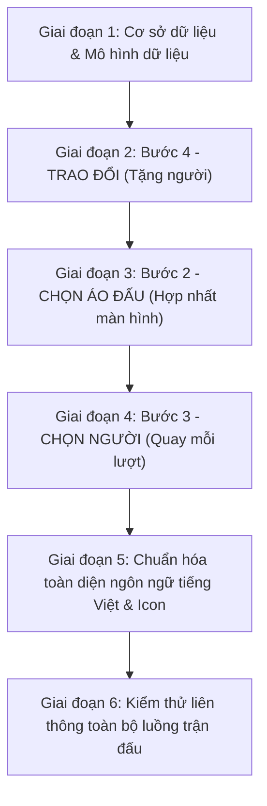

# KẾ HOẠCH TRIỂN KHAI CHI TIẾT v2 — HỆ THỐNG CHIMMOCANH FOOTBALLSQUAD

> **Dự án:** Ứng dụng quản lý chia đội bóng đá phong trào nội bộ  
> **Phiên bản:** v2 (Nâng cấp luồng trận đấu & Giao diện chuẩn tiếng Việt)  
> **Ngày lập:** 2026-10-05  
> **Nguyên tắc kỹ thuật:** Đồng bộ thời gian thực qua WebSocket (STOMP/SockJS) giữa Quản trị viên và hai Đội trưởng.

---

## I. QUY CHUẨN THIẾT KẾ GIAO DIỆN & TÊN BƯỚC

### 1. Chuẩn hóa tên 4 bước quy trình trên giao diện người dùng (UI)

| Thứ tự | Tên bước trên giao diện | Nội dung tích hợp | Trạng thái kỹ thuật tương ứng |
|:---:|---|---|---|
| **Bước 1** | **ĐIỂM DANH** | Điểm danh thành viên có mặt, xác nhận danh sách thi đấu | `CHECK_IN` |
| **Bước 2** | **CHỌN ÁO ĐẤU** | Gộp toàn bộ: Quản trị viên chọn 2 đội trưởng + Hai đội trưởng quay quyền chọn áo + Chọn màu áo đấu | `CAPTAIN_SELECTION` & `JERSEY_SELECTION` |
| **Bước 3** | **CHỌN NGƯỜI** | Bốc thăm chọn cầu thủ từng lượt, mỗi lượt đều quay vòng quay may mắn | `PLAYER_PICKING` |
| **Bước 4** | **TRAO ĐỔI** | Chuyển nhượng cầu thủ giữa hai đội (đổi 1-1 hoặc tặng người trực tiếp) | `TRADE_WINDOW` |

---

### 2. Bộ quy tắc thiết kế giao diện bắt buộc (BẮT BUỘC TUÂN THỦ)

1. **Ngôn ngữ 100% Tiếng Việt có dấu chuẩn**:
   - Tất cả nhãn (labels), nút bấm (buttons), bảng thông báo (dialogs / modals / toasts), tooltip, tiêu đề (headers), mô tả (descriptions), trạng thái (status badges) phải hiển thị bằng tiếng Việt chuẩn ngữ pháp, rõ nghĩa, không viết tắt cẩu thả.
2. **Tuyệt đối KHÔNG sử dụng emoji**:
   - Không được chèn bất kỳ biểu tượng cảm xúc nào (ví dụ: cấm các ký tự dạng biểu cảm hoặc biểu tượng Unicode màu mè trong văn bản và nút bấm).
   - Mọi trạng thái thành công, chờ đợi, lỗi, cảnh báo đều được thể hiện qua màu sắc chuẩn của hệ thống thiết kế và icon hệ thống.
3. **Chỉ sử dụng biểu tượng (Icon font / SVG)**:
   - Sử dụng thư viện **Google Material Symbols Outlined** đã được tích hợp sẵn trong dự án: `<span className="material-symbols-outlined">...</span>`.
   - Một số icon quy ước chuẩn:
     - Trạng thái sẵn sàng: `check_circle`
     - Trạng thái đang chờ: `schedule` hoặc `hourglass_top`
     - Cảnh báo: `warning` hoặc `info`
     - Đội trưởng: `military_tech` hoặc `sports`
     - Vòng quay: `rotate_right` hoặc `casino`
     - Áo đấu: `styler` hoặc `apparel`
     - Trao đổi / Chuyển nhượng: `swap_horiz`
     - Tặng cầu thủ: `forward` hoặc `person_add`
     - Hủy / Đóng: `close`
     - Quản trị viên can thiệp: `admin_panel_settings`
4. **Tuyệt đối KHÔNG ghi chú hoặc chèn từ tiếng Anh trên giao diện**:
   - Chuyển đổi toàn diện các thuật ngữ tiếng Anh thường gặp sang tiếng Việt tương ứng:
     - `Host` / `Admin` -> **Người tạo phòng** / **Quản trị viên**
     - `Captain` -> **Đội trưởng**
     - `Pick` / `Draft` -> **Chọn người**
     - `Spin` -> **Quay vòng quay**
     - `Round` -> **Lượt**
     - `Ready` / `Not Ready` -> **Đã sẵn sàng** / **Đang chuẩn bị**
     - `Trade` / `Swap` -> **Trao đổi**
     - `Donate` / `Gift` -> **Tặng cầu thủ**
     - `Spain` / `France` -> **Tây Ban Nha** (Đỏ) / **Pháp** (Xanh)
     - `Bench` / `Substitutes` -> **Dự bị** / **Chưa phân đội**
     - `Timeout` -> **Hết thời gian**
     - `Proceed` / `Next Step` -> **Chuyển bước tiếp theo**
     - `Lineup` -> **Đội hình thi đấu**
     - `Live` -> **Trực tiếp**

---

## II. CHI TIẾT 3 NHÓM CHỈNH SỬA TÍNH NĂNG

---

### THAY ĐỔI 1: BƯỚC 3 — CHỌN NGƯỜI (QUAY VÒNG QUAY MỖI LƯỢT)

#### 1. Mô tả luồng nghiệp vụ chi tiết
* **Tổng quan**: Không còn việc chỉ quay một lần ở đầu bước rồi chọn tuần tự đến hết. Thay vào đó, **mỗi lượt chọn người đều có một vòng quay may mắn**.
* **Định nghĩa 1 lượt (Round)**:
  - Một lượt chọn gồm 2 lần chọn cầu thủ (mỗi đội chọn đúng 1 người).
  - Trước mỗi lượt: Cả 2 đội trưởng phải bấm nút **"Sẵn sàng"** (hoặc Quản trị viên có quyền bấm nút **"Quản trị viên bắt đầu lượt quay"** để vượt qua nếu cần).
  - Khi cả 2 đã sẵn sàng: Hệ thống hiển thị màn hình đếm ngược **3 giây** (3-2-1).
  - Hết 3 giây: Vòng quay may mắn tự động kích hoạt (tỷ lệ 50/50 giữa 2 đội) để chọn ra đội giành quyền chọn trước trong lượt đó.
* **Thời gian chọn và cơ chế phạt (60 giây)**:
  - Đội thắng vòng quay có **60 giây** để chọn 1 cầu thủ vào đội mình.
  - **Quy định phạt khi hết giờ**: Nếu hết 60 giây mà đội thắng chưa kịp chọn người, quyền chọn trước lập tức bị tước và chuyển sang cho đội thua cuộc (đội thua trở thành đội chọn trước, đội hết giờ phải chờ đối phương chọn xong mới được chọn sau).
  - Sau khi đội chọn trước hoàn tất: Đội còn lại có 60 giây để chọn 1 cầu thủ tiếp theo.
  - Kết thúc lượt: Đảm bảo cả hai đội đều đã chọn đủ người ở lượt hiện tại. Hệ thống chuyển sang trạng thái chờ 2 đội trưởng sẵn sàng cho lượt kế tiếp.
* **Xử lý tình huống cầu thủ lẻ cuối cùng**:
  - Nếu tổng số cầu thủ cần chọn là số lẻ (sau khi trừ 2 đội trưởng): Lượt cuối cùng sẽ chỉ còn duy nhất 1 cầu thủ chưa có đội.
  - Vòng quay may mắn vẫn diễn ra cho lượt này.
  - Đội thắng vòng quay có quyền đưa ra quyết định:
    1. **"Nhận vào đội"**: Nhận cầu thủ này vào đội hình chính của mình.
    2. **"Chuyển vào danh sách dự bị"**: Đưa cầu thủ này vào ghế dự bị (không vào đội nào).
  - Đội thắng vẫn có giới hạn đếm ngược 60 giây để quyết định. Nếu hết 60 giây chưa chọn -> quyền quyết định chuyển giao cho đội còn lại.
* **Kết thúc bước chọn người**:
  - Khi không còn cầu thủ nào trong danh sách chờ chọn (hoặc người cuối cùng đã được quyết định):
  - Cả hai đội trưởng đồng thời bấm nút **"Xác nhận hoàn thành chọn người"** để hệ thống chuyển tiếp sang bước **TRAO ĐỔI**.

#### 2. Kế hoạch kỹ thuật Backend (Java / Spring Boot / PostgreSQL)
* **Migration cơ sở dữ liệu (`V13__add_pick_round_consensus.sql`)**:
  ```sql
  -- Cờ sẵn sàng cho mỗi lượt chọn
  ALTER TABLE matches ADD COLUMN IF NOT EXISTS pick_round_captain_a_ready BOOLEAN DEFAULT FALSE;
  ALTER TABLE matches ADD COLUMN IF NOT EXISTS pick_round_captain_b_ready BOOLEAN DEFAULT FALSE;
  -- Số thứ tự lượt chọn hiện tại
  ALTER TABLE matches ADD COLUMN IF NOT EXISTS current_pick_round INT DEFAULT 0;
  -- Trạng thái chọn trong lượt hiện tại
  ALTER TABLE matches ADD COLUMN IF NOT EXISTS round_first_picker_done BOOLEAN DEFAULT FALSE;
  ALTER TABLE matches ADD COLUMN IF NOT EXISTS round_second_picker_done BOOLEAN DEFAULT FALSE;
  -- Thời điểm bắt đầu lượt tính giây phạt
  ALTER TABLE matches ADD COLUMN IF NOT EXISTS pick_turn_started_at TIMESTAMP;
  ```
* **Cập nhật Entity `Match.java` & DTO `MatchDto.java`**:
  - Khai báo các thuộc tính tương ứng với chú thích JPA `@Column`.
  - Bổ sung vào mapper chuyển đổi sang DTO trả về cho client.
* **Cập nhật `PickService.java`**:
  - `confirmPickRoundReady(UUID matchId, User currentUser)`: Đánh dấu sẵn sàng của Đội trưởng A hoặc B. Nếu cả hai đã sẵn sàng -> phát sự kiện `PICK_ROUND_READY` qua WebSocket.
  - `adminBypassPickReady(UUID matchId)`: Quản trị viên kích hoạt ngay mà không cần đợi.
  - `handlePickTimeoutSwap(UUID matchId)`: Kiểm tra nếu thời gian 60 giây đã trôi qua và người chọn trước chưa chọn -> đảo ngược `firstPickTeam` sang đội còn lại, làm mới mốc thời gian `pickTurnStartedAt`, phát sự kiện `PICK_TIMEOUT_SWAPPED`.
  - `pickPlayer(...)`: Cập nhật logic: khi người chọn trước chọn xong -> đánh dấu `roundFirstPickerDone = true`; khi người thứ hai chọn xong -> đánh dấu `roundSecondPickerDone = true`, reset cờ sẵn sàng của 2 đội trưởng để chuẩn bị cho lượt mới.
  - `handleFinalOddPlayerDecision(UUID matchId, String decision)`: Nhận vào quyết định (`ACCEPT` hoặc `BENCH`), phân bổ cầu thủ tương ứng và cập nhật trạng thái kết thúc lượt pick.
* **Cập nhật `SpinService.java`**:
  - `spinPickTurn(UUID matchId)`: Kiểm tra điều kiện bắt buộc: cả 2 đội trưởng phải ở trạng thái sẵn sàng (hoặc cờ bypass từ quản trị viên). Sau khi quay xong, lưu kết quả đội thắng, tăng `currentPickRound`, đặt mốc `pickTurnStartedAt = LocalDateTime.now()`.
* **Cập nhật Controller & Endpoints**:
  - `POST /api/matches/{id}/pick/ready`: Đội trưởng xác nhận sẵn sàng cho lượt mới.
  - `POST /api/matches/{id}/pick/timeout-swap`: Hoán đổi quyền chọn khi hết 60 giây.
  - `POST /api/matches/{id}/pick/final-odd-decision`: Quyết định số phận cầu thủ lẻ cuối cùng.

#### 3. Kế hoạch kỹ thuật Frontend (React / TypeScript / Tailwind CSS)
* **Tái cấu trúc `PickList.tsx`**:
  - Xây dựng máy trạng thái nội bộ cho từng lượt:
    1. `CHO_SAN_SANG` (Chờ 2 đội trưởng bấm Sẵn sàng)
    2. `DEM_NGUOC_3S` (Hiển thị đếm ngược 3 giây toàn màn hình)
    3. `DANG_QUAY` (Vòng quay may mắn đang quay)
    4. `DOI_THU_NHAT_CHON` (Đội thắng quay đang chọn trong 60 giây)
    5. `DOI_THU_HAI_CHON` (Đội thứ hai đang chọn trong 60 giây)
    6. `XU_LY_NGUOI_CUOI` (Hộp thoại đặc biệt dành cho người lẻ cuối cùng)
    7. `HOAN_TAT_BUOC` (Chờ 2 đội trưởng xác nhận chuyển bước)
  - **Giao diện đếm ngược 3 giây**: Lớp phủ nền tối sang trọng, số đếm 3 - 2 - 1 đổi màu gradient neon rực rỡ.
  - **Đồng hồ đếm ngược 60 giây**: Thanh đo thời gian lùi dần từ xanh sang vàng sang đỏ. Khi còn 10 giây cuối cùng, thanh nhấp nháy cảnh báo. Hết giờ -> tự động kích hoạt lệnh hoán đổi lượt chọn.
  - **Hộp thoại người lẻ cuối cùng**: Thiết kế trang trọng, hiển thị thẻ cầu thủ cùng hai nút hành động: "Tiếp nhận vào đội hình" (icon `person_add`) và "Chuyển vào danh sách dự bị" (icon `chair`).

---

### THAY ĐỔI 2: BƯỚC 2 — CHỌN ÁO ĐẤU (GỘP CHỌN ĐỘI TRƯỞNG & CHỌN ÁO)

#### 1. Mô tả luồng nghiệp vụ chi tiết
* **Gộp toàn bộ vào 1 màn hình duy nhất**: Loại bỏ hoàn toàn sự phân tách giữa 2 tab "Quay Captain" và "Chọn áo đấu". Tên bước trên thanh tiến trình và tab là **CHỌN ÁO ĐẤU**.
* **Phân quyền rõ ràng giữa Quản trị viên và Đội trưởng**:
  1. **Phần việc của Quản trị viên**:
     - Chọn Đội trưởng A và Đội trưởng B từ danh sách thành viên đã điểm danh (bắt buộc phải là hai người khác nhau).
     - Nhấn nút **"Xác nhận chỉ định đội trưởng"** (icon `how_to_reg`).
     - Sau khi xác nhận, vai trò của Quản trị viên kết thúc, quyền tự quyết được giao lại cho 2 Đội trưởng.
  2. **Phần việc của 2 Đội trưởng (Tự vận hành chọn áo)**:
     - **Giai đoạn chuẩn bị**: Cả hai đội trưởng bấm nút **"Sẵn sàng bốc thăm áo"**.
     - **Giai đoạn đếm ngược**: Khi cả 2 đã sẵn sàng, màn hình hiển thị đếm ngược **3 giây** (3-2-1).
     - **Giai đoạn quay may mắn**: Vòng quay may mắn tự động quay 50/50 để quyết định đội trưởng nào được quyền chọn màu áo trước.
     - **Giai đoạn chọn màu áo (60 giây)**:
       - Đội trưởng thắng cuộc có 60 giây để bấm chọn một trong hai màu áo: **Tây Ban Nha (Đỏ `#C60B1E`)** hoặc **Pháp (Xanh `#002395`)**.
       - Nếu hết 60 giây mà chưa chọn -> quyền ưu tiên chọn áo được chuyển sang cho đội trưởng đối phương.
     - **Cửa sổ thông báo nổi bật cho đội trưởng còn lại**:
       - Ngay khi đội trưởng thắng chọn xong áo, màn hình của đội trưởng đối phương lập tức xuất hiện một **cửa sổ thông báo nổi bật** (modal z-index cao nhất, nền phủ tối chống thao tác nhầm).
       - Nội dung thông báo hiển thị bằng chữ tiếng Việt rõ ràng:
         > *"Đội trưởng {Tên đội trưởng đối phương} đã chọn áo đấu: {Tây Ban Nha / Pháp}. Đội của bạn được phân công áo đấu: {Pháp / Tây Ban Nha}."*
       - Cửa sổ có nút bấm icon đóng `close` và tự động biến mất sau **3 giây**.
     - **Xác nhận hoàn thành**: Sau khi áo đấu đã được phân định, cả hai đội trưởng bấm nút **"Xác nhận hoàn thành chọn áo"**.
     - **Đếm ngược 10 giây chuyển bước**:
       - Màn hình đếm ngược 10 giây hiển thị kèm thông điệp hướng dẫn chiến thuật:
         > *"Bước tiếp theo: Chọn người vào đội. Mỗi lượt chọn sẽ quay vòng quay may mắn để xác định đội được chọn trước. Hãy chuẩn bị danh sách cầu thủ mục tiêu và bàn bạc cùng đồng đội!"*
       - Hết 10 giây -> tự động điều hướng sang bước **CHỌN NGƯỜI**.

#### 2. Kế hoạch kỹ thuật Backend
* **Migration cơ sở dữ liệu (`V14__add_jersey_consensus_fields.sql`)**:
  ```sql
  ALTER TABLE matches ADD COLUMN IF NOT EXISTS jersey_captain_a_ready BOOLEAN DEFAULT FALSE;
  ALTER TABLE matches ADD COLUMN IF NOT EXISTS jersey_captain_b_ready BOOLEAN DEFAULT FALSE;
  ALTER TABLE matches ADD COLUMN IF NOT EXISTS jersey_turn_started_at TIMESTAMP;
  ALTER TABLE matches ADD COLUMN IF NOT EXISTS jersey_captain_a_confirmed BOOLEAN DEFAULT FALSE;
  ALTER TABLE matches ADD COLUMN IF NOT EXISTS jersey_captain_b_confirmed BOOLEAN DEFAULT FALSE;
  ```
* **Cập nhật Entity & Service**:
  - `confirmJerseyReady(UUID matchId, User user)`: Đánh dấu sẵn sàng, khi 2/2 sẵn sàng thì phát sự kiện `JERSEY_ROUND_READY`.
  - `selectJersey(UUID matchId, Team team, JerseyColor color, User user)`: Gán màu áo, phát sự kiện `JERSEY_SELECTED` chứa thông tin người chọn và người nhận áo còn lại. Giữ ở bước xác nhận.
  - `confirmJerseyProceed(UUID matchId, User user)`: Ghi nhận xác nhận hoàn thành từ 2 đội trưởng. Khi cả 2 xác nhận -> phát sự kiện `JERSEY_PROCEED_CONFIRMED` kích hoạt đếm ngược 10 giây ở client.
* **Các Endpoint bổ sung**:
  - `POST /api/matches/{id}/jersey/ready`
  - `POST /api/matches/{id}/jersey/select`
  - `POST /api/matches/{id}/jersey/confirm-proceed`

#### 3. Kế hoạch kỹ thuật Frontend
* **Tạo Component mới: `CaptainJerseyStep.tsx`**:
  - Thay thế hoàn toàn hai component rời rạc cũ.
  - Chia làm các khu vực giao diện mạch lạc:
    1. *Khu vực Quản trị viên*: Chỉ hiển thị với người tạo phòng để chỉ định 2 đội trưởng.
    2. *Khu vực Đồng thuận*: Thẻ trạng thái của 2 đội trưởng với icon `check_circle` (Đã sẵn sàng) hoặc `schedule` (Đang chuẩn bị).
    3. *Khu vực Đếm ngược 3s & Vòng quay*: Tự động hiển thị và kích hoạt khi đủ điều kiện.
    4. *Khu vực Lựa chọn áo đấu*: Hai thẻ áo đấu được thiết kế đồ họa chất lượng cao (Tây Ban Nha đỏ phối viền vàng kim, Pháp xanh nước biển phối viền trắng).
    5. *Hộp thoại thông báo tự động (Modal 3s)*: Dùng Portal để đưa lên lớp trên cùng (`z-index: 99999`), có thanh tiến trình co dần báo hiệu 3 giây tự đóng.
    6. *Khu vực Đếm ngược 10 giây chuyển bước*: Hiển thị hộp thông tin hướng dẫn màu xanh neon/cyan sang trọng.

---

### THAY ĐỔI 3: BƯỚC 4 — TRAO ĐỔI (TẶNG CẦU THỦ & KHỐNG CHẾ CHÊNH LỆCH SĨ SỐ)

#### 1. Mô tả luồng nghiệp vụ chi tiết
* **Thêm tính năng "Tặng cầu thủ" (Cho người một chiều)**:
  - Cho phép Đội trưởng có thể điều chuyển một cầu thủ thuộc đội mình sang đội đối phương mà **không bắt buộc phải nhận lại** cầu thủ nào từ đội bạn.
  - Không được phép chuyển chính bản thân Đội trưởng.
* **Quy tắc khống chế sĩ số nghiêm ngặt**:
  - Sĩ số giữa hai đội **tuyệt đối không được chênh lệch quá 2 người** trong suốt giai đoạn trao đổi.
  - Ví dụ:
    - Đội A có 7 người, Đội B có 7 người: Đội A tặng 1 người sang B -> Đội A còn 6, Đội B lên 8 (Chênh lệch: $|6 - 8| = 2$ -> **HỢP LỆ**).
    - Đội A có 6 người, Đội B có 8 người: Đội A muốn tặng tiếp 1 người sang B -> Đội A còn 5, Đội B lên 9 (Chênh lệch: $|5 - 9| = 4 > 2$ -> **BỊ CHẶN VÀ BÁO LỖI**).
    - Tương tự, thao tác đổi người 1-1 sẽ luôn giữ nguyên sĩ số nên luôn hợp lệ.
* **Bảng thông báo quy định giao diện**:
  - Đặt một khung thông báo nổi bật ở đầu trang bước Trao đổi.
  - Thiết kế: Nền vàng ấm (`bg-amber-500/10`), viền vàng (`border-amber-500/30`), chữ màu vàng sáng rõ ràng.
  - Icon: `info` (biểu tượng thông tin, không dùng emoji).
  - Nội dung tiếng Việt có dấu:
    > **QUY ĐỊNH CHUYỂN NHƯỢNG VÀ TRAO ĐỔI CẦU THỦ**  
    > Trong bước này, ngoài việc trao đổi người một-đổi-một giữa hai đội, đội trưởng có thể lựa chọn tặng trực tiếp cầu thủ của đội mình sang đội bạn mà không cần nhận người về. Tuy nhiên, để đảm bảo tính cân bằng của trận đấu, sĩ số giữa hai đội tuyệt đối không được chênh lệch vượt quá 2 người sau mỗi lần chuyển nhượng. Hãy tính toán kỹ lưỡng đội hình trước khi xác nhận.

#### 2. Kế hoạch kỹ thuật Backend
* **Cập nhật `TradeService.java`**:
  - Viết mới hàm `donatePlayer(UUID matchId, UUID playerId, User currentUser)`:
    1. Kiểm tra trận đấu đang ở trạng thái `TRADE_WINDOW`.
    2. Kiểm tra `currentUser` có phải là đội trưởng của đội sở hữu cầu thủ này không.
    3. Kiểm tra cầu thủ được tặng không phải là chính đội trưởng.
    4. Tính toán chênh lệch sĩ số giả định sau khi tặng:
       $$\text{Sĩ số A sau tặng} = \text{Số lượng A} - 1, \quad \text{Sĩ số B sau tặng} = \text{Số lượng B} + 1$$
       $$\text{Chênh lệch} = |\text{Sĩ số A sau tặng} - \text{Sĩ số B sau tặng}|$$
       Nếu $\text{Chênh lệch} > 2$ -> ném lỗi `BadRequestException("Thao tác bị từ chối: Chênh lệch sĩ số giữa hai đội không được vượt quá 2 người.")`.
    5. Cập nhật `team` của cầu thủ sang đội đối phương.
    6. Tạo bản ghi lịch sử chuyển nhượng đánh dấu là tặng người (`TradeRequest` với `playerWanted = null` và trạng thái `COMPLETED`).
    7. Phát thông báo WebSocket cập nhật đội hình tức thời cho tất cả mọi người.
* **Controller**:
  - `POST /api/matches/{id}/trade/donate`: Nhận `DonatePlayerRequest { UUID playerId }`.

#### 3. Kế hoạch kỹ thuật Frontend
* **Cập nhật `TradeWindow.tsx`**:
  - Hiển thị Bảng quy định chuyển nhượng nền vàng ở vị trí trang trọng nhất.
  - Bổ sung bảng thông tin sĩ số trực quan:
    - `Đội Tây Ban Nha: X cầu thủ`
    - `Đội Pháp: Y cầu thủ`
    - `Chênh lệch hiện tại: |X - Y| cầu thủ`
  - Thêm thẻ hành động **"Tặng cầu thủ sang đội bạn"**:
    - Danh sách thả xuống chọn cầu thủ của đội mình (loại trừ đội trưởng).
    - Nút bấm: "Xác nhận chuyển nhượng một chiều" (icon `forward`).
    - Nút bấm sẽ tự động bị vô hiệu hóa (disabled) kèm cảnh báo giải thích nếu thao tác đó khiến chênh lệch sĩ số vượt quá 2.

---

## III. BẢNG TỔNG HỢP CÁC FILE CẦN THỰC HIỆN

### 1. Phía Backend (Java / Spring Boot)

| STT | Đường dẫn file | Thao tác | Mô tả chi tiết nhiệm vụ |
|:---:|---|:---:|---|
| 1 | `backend/.../resources/db/migration/V13__add_pick_round_consensus.sql` | **Tạo mới** | Thêm các cột quản lý lượt pick, cờ sẵn sàng, thời điểm bắt đầu lượt |
| 2 | `backend/.../resources/db/migration/V14__add_jersey_consensus_fields.sql` | **Tạo mới** | Thêm các cột đồng thuận chọn áo, mốc thời gian chọn áo |
| 3 | `backend/.../entity/Match.java` | Sửa | Khai báo các trường mới tương ứng 2 file migration |
| 4 | `backend/.../dto/match/MatchDto.java` | Sửa | Bổ sung các trường mới vào DTO phản hồi |
| 5 | `backend/.../dto/trade/DonatePlayerRequest.java` | **Tạo mới** | DTO chứa `playerId` muốn tặng |
| 6 | `backend/.../service/PickService.java` | Sửa | Xây dựng logic sẵn sàng từng lượt, hoán đổi khi timeout, xử lý người lẻ |
| 7 | `backend/.../controller/PickController.java` | Sửa | Bổ sung 3 endpoint mới phục vụ lượt pick |
| 8 | `backend/.../service/MatchService.java` | Sửa | Thêm hàm xử lý sẵn sàng chọn áo, hoàn thành chọn áo |
| 9 | `backend/.../controller/MatchController.java` | Sửa | Bổ sung endpoint sẵn sàng và chuyển bước chọn áo |
| 10 | `backend/.../service/SpinService.java` | Sửa | Kiểm tra điều kiện đồng thuận trước khi cho phép quay |
| 11 | `backend/.../service/TradeService.java` | Sửa | Viết hàm `donatePlayer`, kiểm tra giới hạn chênh lệch sĩ số $\le 2$ |
| 12 | `backend/.../controller/TradeController.java` | Sửa | Thêm endpoint tặng cầu thủ `/api/matches/{id}/trade/donate` |
| 13 | `backend/.../service/NotificationService.java` | Sửa | Bổ sung các phương thức phát sự kiện WebSocket mới |

---

### 2. Phía Frontend (React / TypeScript / Tailwind CSS)

| STT | Đường dẫn file | Thao tác | Mô tả chi tiết nhiệm vụ |
|:---:|---|:---:|---|
| 1 | `frontend/src/types/index.ts` | Sửa | Khai báo bổ sung các thuộc tính mới trong kiểu `Match` |
| 2 | `frontend/src/services/matchService.ts` | Sửa | Thêm API: sẵn sàng chọn áo, xác nhận hoàn thành chọn áo |
| 3 | `frontend/src/services/pickService.ts` | Sửa | Thêm API: sẵn sàng lượt chọn, đổi quyền do timeout, quyết định người lẻ |
| 4 | `frontend/src/services/tradeService.ts` | Sửa | Thêm API: tặng cầu thủ `donatePlayer` |
| 5 | `frontend/src/components/match/CaptainJerseyStep.tsx` | **Tạo mới** | Màn hình hợp nhất Bước 2 "CHỌN ÁO ĐẤU" (chọn ĐT, quay áo, popup thông báo, đếm ngược 10s) |
| 6 | `frontend/src/components/match/PickList.tsx` | Sửa lớn | Tái cấu trúc thành luồng quay may mắn mỗi lượt, đếm ngược 3s, timeout 60s, modal người cuối |
| 7 | `frontend/src/components/match/TradeWindow.tsx` | Sửa | Thêm banner quy định vàng, bảng sĩ số, chức năng tặng cầu thủ khống chế chênh lệch |
| 8 | `frontend/src/pages/MatchDetailPage.tsx` | Sửa | Cập nhật tab 4 bước chuẩn tên tiếng Việt, lắng nghe WebSocket mới, liên kết component mới |

---

## IV. TRÌNH TỰ TRIỂN KHAI THEO TỪNG GIAI ĐOẠN



### Chi tiết các bước thực hiện:

1. **Giai đoạn 1 — Cơ sở dữ liệu & Mô hình dữ liệu**:
   - Viết 2 file migration Flyway `V13` và `V14`.
   - Cập nhật Entity `Match.java` và `MatchDto.java`.
   - Chạy kiểm tra để đảm bảo migration thành công trong PostgreSQL.

2. **Giai đoạn 2 — Bước 4: TRAO ĐỔI (Tặng người không cần đổi 1-1)**:
   - Viết API `POST /api/matches/{id}/trade/donate` kèm kiểm tra chênh lệch sĩ số $\le 2$.
   - Cập nhật giao diện `TradeWindow.tsx`: Banner cảnh báo tiếng Việt nền vàng, icon `info`, giao diện tặng cầu thủ.
   - Thử nghiệm tính năng chuyển nhượng một chiều.

3. **Giai đoạn 3 — Bước 2: CHỌN ÁO ĐẤU (Gộp màn hình Đội trưởng & Áo đấu)**:
   - Viết các API sẵn sàng chọn áo và đồng thuận chuyển bước ở backend.
   - Xây dựng component hợp nhất `CaptainJerseyStep.tsx`.
   - Tích hợp đếm ngược 3s trước khi quay, đồng hồ 60s chọn áo, popup thông báo 3s ở phía đối phương và đếm ngược 10s chuyển bước kèm thông điệp chiến thuật.

4. **Giai đoạn 4 — Bước 3: CHỌN NGƯỜI (Vòng quay may mắn ở mọi lượt)**:
   - Viết logic quản lý lượt chọn, kiểm tra 2 đội trưởng sẵn sàng, timeout hoán đổi quyền, xử lý người lẻ cuối cùng.
   - Tái cấu trúc toàn diện `PickList.tsx`.
   - Đồng bộ WebSocket các sự kiện bắt đầu lượt, kết thúc lượt, chuyển quyền chọn.

5. **Giai đoạn 5 — Rà soát & Chuẩn hóa toàn bộ UI**:
   - Kiểm tra toàn bộ mã nguồn Frontend: Đảm bảo 100% tiếng Việt có dấu.
   - Loại bỏ sạch toàn bộ emoji khỏi tất cả các trang, thay bằng Google Material Symbols.
   - Loại bỏ sạch các từ tiếng Anh sót lại trên giao diện.

6. **Giai đoạn 6 — Kiểm thử liên thông thực tế (E2E Test)**:
   - Mở 3 phiên trình duyệt (1 Quản trị viên, 1 Đội trưởng A, 1 Đội trưởng B).
   - Đi qua toàn bộ quy trình: ĐIỂM DANH -> CHỌN ÁO ĐẤU -> CHỌN NGƯỜI -> TRAO ĐỔI -> ĐỘI HÌNH RA SÂN.
